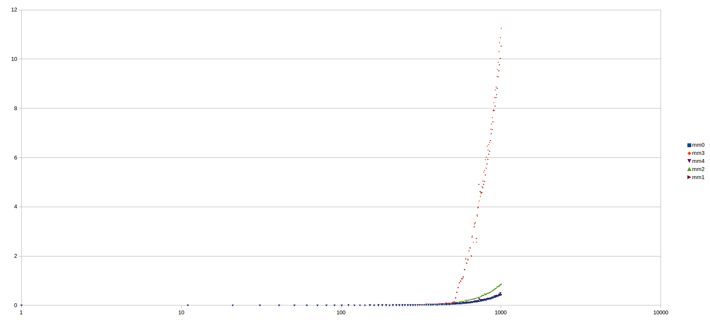

# Matrix multiply

### Modules

* `mm0` - without optimization
* `mm1` - using `dot_product` function
* `mm2` - using CPU cache
* `mm3` - both optimizations
* `mm4` - using built-in `matmul` function

### Tests

To run tests use `make test` and provide `M` variable with selected module i.e.
```
make M=mm1 test
```

### Times

To generate times for all modules use `make measure`. Results are saved in times directory.



